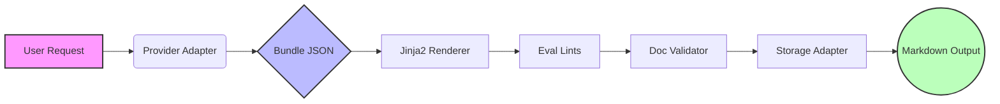

# DecisionDoc AI

API-only FastAPI service that converts requirement input into 4 decision documents in Markdown:

- ADR
- Onepager
- Eval Plan
- Ops Checklist

## Portfolio Highlights (KR + EN)

### Architecture



- **Architecture discipline**: `Provider -> Bundle(JSON) -> Jinja2 -> Eval Lints -> Validator -> Storage`
- **Contract stability**: unified API error schema `{code, message, request_id}` + `X-Request-Id` propagation
- **Security guardrails**: API key protection for generation endpoints, constant-time compare, no secret logging
- **Quality assurance**: fixture-based regression tests, golden snapshots, eval report pipeline
- **Ops readiness**: offline CI, opt-in live tests, AWS SAM deploy with throttling/concurrency controls

## Tech Stack

- FastAPI + Pydantic v2
- Jinja2 templates (`app/templates/v1/`)
- Provider adapters: `mock` (default), `openai`, `gemini`
- Storage adapters: `local` (default), `s3`
- Pytest + fixture/golden/eval test strategy

## Run (Windows PowerShell)

```powershell
cd decisiondoc-ai
python -m venv .venv
.\.venv\Scripts\Activate.ps1
pip install -r requirements.txt
uvicorn app.main:app --reload
```

Swagger UI: `http://127.0.0.1:8000/docs`

## API Endpoints

### GET `/health`

Response:

```json
{ "status": "ok", "provider": "mock" }
```

### POST `/generate`

Generates Markdown docs and returns them in response.

### POST `/generate/export`

Generates Markdown docs, returns response, and persists exported `.md` files.

### POST `/ops/investigate`

Runs an on-demand operational investigation window and stores sanitized evidence to S3.
Auth header: `X-DecisionDoc-Ops-Key`

## Request ID (Tracing)

- Header: `X-Request-Id`
- Safe token pattern: `[A-Za-z0-9._-]{8,64}`
- If valid header is provided, server echoes it.
- If missing/invalid, server generates a UUID.
- Include `request_id` when reporting bugs.

## Auth (Generate Endpoints)

- Protected endpoints:
  - `POST /generate`
  - `POST /generate/export`
- Auth header: `X-DecisionDoc-Api-Key`
- Key env precedence:
  - `DECISIONDOC_API_KEYS` (comma-separated, rotation-ready)
  - fallback: `DECISIONDOC_API_KEY` (legacy single key)
- In deployed env (`DECISIONDOC_ENV=prod`), at least one effective key is required and exact header match is required for protected endpoints.
- In local dev (`DECISIONDOC_ENV=dev`), missing API keys are allowed for DX.
- `/health` is always public.
- In production (`DECISIONDOC_ENV=prod`), startup fails fast if no effective API key is configured.

Example:

```powershell
curl -X POST "http://127.0.0.1:8000/generate" `
  -H "Content-Type: application/json" `
  -H "X-DecisionDoc-Api-Key: ***" `
  -d "{\"title\":\"Auth Smoke\",\"goal\":\"Verify API key guard\"}"
```

## Auth Rotation

- Use `DECISIONDOC_API_KEYS` for rotation, e.g. `old_key,new_key`.
- Rotation procedure:
  - deploy with both old+new keys
  - switch clients to new key
  - remove old key in the next deploy
- Legacy `DECISIONDOC_API_KEY` remains supported for backward compatibility.

## CORS / Preflight

- Toggle app CORS middleware:
  - `DECISIONDOC_CORS_ENABLED=1`
  - `DECISIONDOC_CORS_ALLOW_ORIGINS=https://a.example,https://b.example`
- If CORS origins are not set in dev, app defaults to `*`.
- Preflight `OPTIONS` requests bypass API key auth to avoid browser integration failures.

## Prod Hardening

- When `DECISIONDOC_ENV=prod`, the app disables:
  - `/docs`
  - `/redoc`
  - `/openapi.json`

## Ops Investigate

- Endpoint: `POST /ops/investigate`
- Header: `X-DecisionDoc-Ops-Key: ***` (`DECISIONDOC_OPS_KEY`)
- Request body:
  - `window_minutes` (default `30`, max `180`)
  - `reason` (optional, sanitized)
  - `stage` (`dev|prod`, optional)
  - `force` (optional, default `false`; set `true` to bypass dedupe cache)
- Response:
  - `incident_id`
  - `incident_key` (deterministic dedupe key)
  - `deduped` (whether cached response was returned)
  - `summary` (counts, p95 timings, top error codes)
  - `statuspage_incident_url`
  - `report_s3_key` (internal S3 key)
  - `statuspage_posted` / `statuspage_error` (partial-failure visibility)

Behavior:

- Dedupe is enabled for repeated requests within TTL:
  - `DECISIONDOC_INVESTIGATE_DEDUP_TTL_SECONDS` (default `300`)
  - `DECISIONDOC_INVESTIGATE_BUCKET_SECONDS` (default `300`)
- Same `incident_key` reuses the same Statuspage incident (avoids duplicates).
- Statuspage update spam is throttled by:
  - `DECISIONDOC_INVESTIGATE_STATUSPAGE_UPDATE_MIN_SECONDS` (default `600`)
- By default, Statuspage failure does not fail investigation (`statuspage_posted=false`).
  - Strict mode: `DECISIONDOC_OPS_STATUSPAGE_STRICT=1`

Example:

```powershell
curl -X POST "http://127.0.0.1:8000/ops/investigate" `
  -H "Content-Type: application/json" `
  -H "X-DecisionDoc-Ops-Key: ***" `
  -d "{\"window_minutes\":30,\"reason\":\"Investigate elevated 5xx\",\"stage\":\"dev\"}"
```

## Request Example

```json
{
  "title": "DecisionDoc AI MVP",
  "goal": "Generate 4 standard decision docs",
  "context": "2-week API-first MVP",
  "constraints": "No external API calls",
  "priority": "maintainability > security > cost > performance > speed",
  "doc_types": ["adr", "onepager", "eval_plan", "ops_checklist"],
  "audience": "mixed",
  "assumptions": ["Windows-first local development"]
}
```

## Response Fields

- `request_id`: trace identifier from `X-Request-Id`
- `bundle_id`: persisted artifact identifier (UUID)
- `title`: echoed request title
- `provider`: active provider
- `schema_version`: bundle schema version (`v1`)
- `cache_hit`: `true/false/null` (`null` when cache disabled)
- `docs`: list of `{doc_type, markdown}`

For `/generate/export`:

- `export_dir`
- `files`: list of `{doc_type, path}`

## Unified Error Contract

All API errors return:

```json
{
  "code": "PROVIDER_FAILED",
  "message": "Provider request failed.",
  "request_id": "..."
}
```

Common `code` values:

- `UNAUTHORIZED`
- `REQUEST_VALIDATION_FAILED`
- `PROVIDER_FAILED`
- `EVAL_LINT_FAILED`
- `DOC_VALIDATION_FAILED`
- `STORAGE_FAILED`
- `INTERNAL_ERROR`

## Validation & Quality Guardrails

- Input validation (Pydantic strict model)
- Template rendering from versioned templates (`v1`)
- Eval lints:
  - required headings
  - banned tokens (`TODO`, `TBD`, `FIXME`)
  - non-empty critical sections
- Document integrity validator:
  - required section headings per doc type
  - ADR must contain `## Options` with at least 2 options

## Observability

Structured JSON logs (one event per request):

- base fields: `request_id`, `method`, `path`, `status_code`, `latency_ms`
- generate fields: `provider`, `template_version`, `schema_version`, `cache_hit`
- stage timings: `provider_ms`, `render_ms`, `lints_ms`, `validator_ms`, `export_ms` (export only)

Privacy policy:

- request body is not logged
- API keys/env secret values are not logged
- raw model output is not logged

## Environment Variables

Copy from `.env.example`:

```env
DECISIONDOC_PROVIDER=mock
DECISIONDOC_ENV=dev
DECISIONDOC_API_KEYS=
DECISIONDOC_API_KEY=
DECISIONDOC_OPS_KEY=
DECISIONDOC_MAINTENANCE=0
DECISIONDOC_CORS_ENABLED=0
DECISIONDOC_CORS_ALLOW_ORIGINS=
DECISIONDOC_STORAGE=local
DATA_DIR=./data
EXPORT_DIR=./data
DECISIONDOC_CACHE_ENABLED=0
DECISIONDOC_TEMPLATE_VERSION=v1
DECISIONDOC_S3_BUCKET=
DECISIONDOC_S3_PREFIX=decisiondoc-ai/
DECISIONDOC_HTTP_API_ID=
DECISIONDOC_LAMBDA_FUNCTION_NAME=
STATUSPAGE_PAGE_ID=
STATUSPAGE_API_KEY=
DECISIONDOC_INVESTIGATE_DEDUP_TTL_SECONDS=300
DECISIONDOC_INVESTIGATE_BUCKET_SECONDS=300
DECISIONDOC_INVESTIGATE_STATUSPAGE_UPDATE_MIN_SECONDS=600
DECISIONDOC_OPS_STATUSPAGE_STRICT=0
OPENAI_API_KEY=
GEMINI_API_KEY=
```

Key handling:

- Environment variables only
- Never commit `.env`
- Never paste secrets into logs/issues/README

## Storage

Default local storage:

- `DECISIONDOC_STORAGE=local`
- bundle: `./data/<bundle_id>.json`
- export: `./data/<bundle_id>/<doc_type>.md` (or `EXPORT_DIR` override)

S3 storage:

- `DECISIONDOC_STORAGE=s3`
- required: `DECISIONDOC_S3_BUCKET`
- optional: `DECISIONDOC_S3_PREFIX` (default `decisiondoc-ai/`)
- key scheme:
  - `bundles/{bundle_id}.json`
  - `exports/{bundle_id}/{doc_type}.md`

## CI / Test Strategy

Offline suite (required):

```powershell
python -m pytest -q
```

Rules:

- CI runs offline tests only
- `--update-golden` is blocked in CI
- eval runner is enforced in CI

Golden snapshots:

```powershell
python -m pytest -q -k golden
python -m pytest -q --update-golden -k golden
```

## Eval Reports

Generate eval report from fixtures:

```powershell
python -m app.eval --fail-on-error
```

Outputs:

- `reports/eval/v1/eval_report.json`
- `reports/eval/v1/eval_report.md`

## Live Tests (Opt-in)

Local live tests:

```powershell
# OpenAI
$env:DECISIONDOC_PROVIDER="openai"
$env:OPENAI_API_KEY="***"
python -m pytest -m live -q

# Gemini
$env:DECISIONDOC_PROVIDER="gemini"
$env:GEMINI_API_KEY="***"
python -m pytest -m live -q
```

GitHub Actions live workflows:

- `live`: provider-specific smoke
- `live-eval`: fixed 3-fixture comparison (`openai` vs `gemini`)

Live eval guardrails:

- fixed fixtures (non-random)
- cache off for fair comparison
- bounded call budget
- no raw requirements/model outputs in reports

## Deployment (AWS)

- Manual deploy workflow only: `.github/workflows/deploy.yml` (`workflow_dispatch`)
- Serverless package: AWS Lambda + API Gateway HTTP API (SAM)
- Runtime storage default in deployment: S3

Cost guardrails in SAM:

- HTTP API throttling (`ThrottlingBurstLimit`, `ThrottlingRateLimit`)
- Lambda reserved concurrency cap (`ReservedConcurrentExecutions`)

Runbook:

- `docs/deploy_aws.md`

## Security Warning

Do not include sensitive customer data in requests for this MVP.
Do not commit credentials, `.env`, or secret-bearing artifacts.
