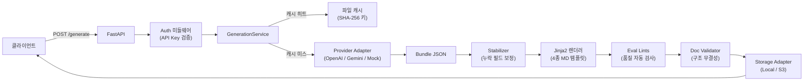

# DecisionDoc AI

> AI가 요구사항을 받아 **4종 의사결정 문서를 자동 생성**하는 FastAPI 백엔드 서비스  
> An API-first FastAPI service that converts requirements into 4 decision documents via LLM.

[](https://python.org)
[](https://fastapi.tiangolo.com)
[](#테스트--test-strategy)

---

## 생성 문서 4종 / Generated Document Types

| 문서 | 설명 |
|------|------|
| **ADR** (Architecture Decision Record) | 기술 결정 기록 — 옵션 비교, 리스크, 다음 액션 |
| **Onepager** | 의사결정 요약 보고서 — 문제·권고안·임팩트 |
| **Eval Plan** | 평가·검증 계획서 — 메트릭, 테스트 케이스, 모니터링 |
| **Ops Checklist** | 운영 준비 체크리스트 — 보안, 신뢰성, 비용, 운영 |

---

## 아키텍처 / Architecture

```
[요구사항] → [LLM Provider] → [Bundle JSON] → [Jinja2 렌더링] → [품질 검증] → [Markdown 출력]
```



### 계층 구조 / Layer Structure

| 계층 | 역할 |
|------|------|
| **API Layer** (`main.py`) | 엔드포인트, 미들웨어, 예외 핸들러 |
| **Service Layer** (`generation_service.py`) | 전체 생성 파이프라인 오케스트레이션 |
| **Provider Layer** (`providers/`) | LLM 공급자 추상화 — 교체 가능한 어댑터 구조 |
| **Storage Layer** (`storage/`) | 번들·익스포트 저장소 추상화 |
| **Observability** (`middleware/`, `observability/`) | 구조화 JSON 로그, 요청 추적 |

---

## 주요 기능 / Key Features

### 🤖 멀티 LLM 공급자
- **OpenAI** (gpt-4o-mini) / **Gemini** (gemini-1.5-flash) / **Mock** (테스트용)
- 환경변수 한 줄로 전환: `DECISIONDOC_PROVIDER=openai`
- `Provider` 추상 인터페이스로 신규 LLM 추가 용이

### ⚡ 응답 캐싱
- 동일 요구사항 + 공급자 → SHA-256 키로 파일 캐싱
- Atomic write(tmp → rename)로 캐시 파일 손상 방지
- `DECISIONDOC_CACHE_ENABLED=1` opt-in 활성화

### 🛡️ 5단계 품질 보증 파이프라인
1. **Pydantic 입력 검증** — strict 모드, 허용 외 필드 차단
2. **Bundle Schema 검증** — LLM 출력 구조 확인
3. **Stabilizer** — 누락 필드 자동 보정 (null-safe 렌더링 보장)
4. **Eval Lints** — `TODO/TBD/FIXME` 금지, 최소 길이, 필수 섹션 확인
5. **Doc Validator** — 필수 헤딩 존재 확인, ADR Options ≥ 2 보장

### 🔐 보안
- `X-DecisionDoc-Api-Key` 헤더 인증 (constant-time compare로 timing attack 방지)
- 복수 키 로테이션 지원: `DECISIONDOC_API_KEYS=old_key,new_key`
- `prod` 환경에서 API 키 미설정 시 서버 시작 차단
- API 키, 요청 바디, LLM 출력 로그 미기록

### 📊 가관측성 (Observability)
- 모든 요청에 구조화 JSON 로그 1건 기록
- `X-Request-Id` 헤더로 분산 추적 (제공 시 에코, 없으면 UUID 자동 생성)
- 단계별 타이밍: `provider_ms`, `render_ms`, `lints_ms`, `validator_ms`, `export_ms`
- LLM 토큰 사용량 추적: `prompt_tokens`, `output_tokens`, `total_tokens`

### 🚨 Ops 자동화
- `POST /ops/investigate` — 온디맨드 운영 장애 조사
  - 지정 시간 윈도우 로그 집계, p95 타이밍, 에러 코드 분포 산출
  - S3 증거 리포트 저장, Statuspage 인시던트 자동 생성/업데이트
  - TTL 기반 중복 조사 방지 (dedup cache)

---

## Tech Stack

| 영역 | 기술 |
|------|------|
| **Framework** | FastAPI + Pydantic v2 |
| **LLM** | OpenAI Responses API, Google Gemini |
| **템플릿** | Jinja2 |
| **스토리지** | Local FS / AWS S3 |
| **배포** | AWS Lambda + API Gateway (SAM) |
| **테스트** | pytest (fixture, golden snapshot, eval pipeline) |
| **런타임** | Python 3.12 |

---

## 로컬 실행 / Quick Start

```bash
# 의존성 설치
python -m venv .venv && source .venv/bin/activate  # Windows: .\.venv\Scripts\Activate.ps1
pip install -r requirements.txt

# 환경 설정
cp .env.example .env   # DECISIONDOC_PROVIDER=mock (기본값, API 키 불필요)

# 서버 실행
uvicorn app.main:app --reload
# → http://localhost:8000/docs 에서 Swagger UI 확인

# 테스트 실행
pytest tests/
```

---

## API 엔드포인트 / API Endpoints

### `POST /generate` — 문서 생성

**요청 예시:**
```json
{
  "title": "결제 서비스 MSA 전환",
  "goal": "모놀리식 결제 모듈을 MSA로 분리",
  "context": "월 거래량 100만 건, B2B SaaS",
  "constraints": "기존 DB 스키마 유지, 3개월 이내 완료",
  "priority": "reliability > security > performance > cost",
  "doc_types": ["adr", "onepager", "eval_plan", "ops_checklist"],
  "audience": "engineering + cto"
}
```

**응답 예시:**
```json
{
  "request_id": "abc-123",
  "bundle_id": "f47ac10b-...",
  "provider": "openai",
  "schema_version": "v1",
  "cache_hit": false,
  "docs": [
    { "doc_type": "adr", "markdown": "# ADR: 결제 서비스 MSA 전환\n\n## Goal\n..." },
    { "doc_type": "onepager", "markdown": "..." }
  ]
}
```

### `POST /generate/export` — 문서 생성 + 파일 저장
위와 동일하나 Markdown 파일을 스토리지에 저장하고 경로를 반환합니다.

### `GET /health` — 헬스체크 (인증 불필요)

### `POST /ops/investigate` — 운영 장애 조사 (`X-DecisionDoc-Ops-Key` 필요)

---

## 인증 / Auth

- 보호 엔드포인트: `POST /generate`, `POST /generate/export`
- 인증 헤더: `X-DecisionDoc-Api-Key`
- 키 우선순위: `DECISIONDOC_API_KEYS` (쉼표 구분, 로테이션) → `DECISIONDOC_API_KEY` (레거시)
- `dev` 환경에서는 키 없이 동작 (DX 편의)
- `/health`는 항상 공개

```bash
curl -X POST "http://127.0.0.1:8000/generate" \
  -H "Content-Type: application/json" \
  -H "X-DecisionDoc-Api-Key: your-key" \
  -d '{"title":"Test","goal":"Smoke test"}'
```

---

## 통합 에러 계약 / Unified Error Contract

모든 에러 응답이 동일한 형태로 반환됩니다:

```json
{
  "code": "PROVIDER_FAILED",
  "message": "Provider request failed.",
  "request_id": "abc-123"
}
```

| code | HTTP | 상황 |
|------|------|------|
| `UNAUTHORIZED` | 401 | API 키 불일치 |
| `REQUEST_VALIDATION_FAILED` | 422 | 입력 스키마 오류 |
| `PROVIDER_FAILED` | 500 | LLM 호출 실패 |
| `EVAL_LINT_FAILED` | 500 | 품질 검사 실패 |
| `DOC_VALIDATION_FAILED` | 500 | 문서 구조 검증 실패 |
| `MAINTENANCE_MODE` | 503 | 점검 중 |

---

## 테스트 전략 / Test Strategy

```bash
pytest tests/         # 전체 오프라인 테스트 (75 passed)
pytest tests/ -m live # Live LLM 테스트 (API 키 필요, opt-in)
python -m app.eval    # Eval 리포트 생성 (reports/eval/v1/)
```

| 전략 | 내용 |
|------|------|
| **Fixture 기반 회귀 테스트** | 다양한 입력 케이스를 JSON fixture로 관리 |
| **Golden Snapshot 테스트** | 렌더링 포맷 변경 감지 |
| **Eval Pipeline** | 전체 fixture 품질 점수 및 리포트 자동 생성 |
| **Live 테스트 (opt-in)** | 실제 OpenAI / Gemini 호출 검증 |
| **에러 계약 테스트** | 모든 에러 코드·상태코드·응답 구조 보장 |

---

## 스토리지 / Storage

| 모드 | 번들 경로 | 익스포트 경로 |
|------|-----------|---------------|
| **Local** (기본) | `./data/{bundle_id}.json` | `./exports/{bundle_id}/{doc_type}.md` |
| **S3** | `bundles/{bundle_id}.json` | `exports/{bundle_id}/{doc_type}.md` |

전환: `DECISIONDOC_STORAGE=s3` + `DECISIONDOC_S3_BUCKET=my-bucket`

---

## 주요 환경변수 / Environment Variables

`.env.example`을 복사하여 사용:

```env
DECISIONDOC_PROVIDER=mock          # mock | openai | gemini
DECISIONDOC_ENV=dev                # dev | prod
DECISIONDOC_API_KEYS=              # 쉼표 구분 복수 키 (로테이션 지원)
DECISIONDOC_CACHE_ENABLED=0        # 1 = 캐싱 활성화
DECISIONDOC_STORAGE=local          # local | s3
DECISIONDOC_MAINTENANCE=0          # 1 = 점검 모드 (503 반환)
DECISIONDOC_CORS_ENABLED=0         # 1 = CORS 미들웨어 활성화
OPENAI_API_KEY=
GEMINI_API_KEY=
```

> ⚠️ `.env` 파일은 절대 커밋하지 마세요. API 키를 로그·이슈·README에 노출하지 마세요.

---

## 배포 / Deployment (AWS)

- AWS Lambda + API Gateway HTTP API (SAM)
- 수동 배포 전용: `.github/workflows/deploy.yml` (`workflow_dispatch`)
- 런타임 스토리지: S3 자동 전환
- 비용 보호: API Gateway throttling + Lambda reserved concurrency 제한
- 배포 상세: [`docs/deploy_aws.md`](docs/deploy_aws.md)

---

## 활용 방안 / Use Cases

| 상황 | 활용 방법 |
|------|-----------|
| **스타트업 기술 의사결정** | 새 기능/시스템 검토 시 ADR + Onepager 초안 자동 생성 → 팀 리뷰 |
| **개발팀 온보딩** | 운영 시스템의 의사결정 맥락을 빠르게 문서화 |
| **컨설팅·SI 프로젝트** | 고객사 요구사항 수집 후 Eval Plan · Ops Checklist 자동 생성 |
| **내부 도구 연동** | Jira / Confluence / Notion API와 연결해 문서 자동 발행 파이프라인 구성 |
