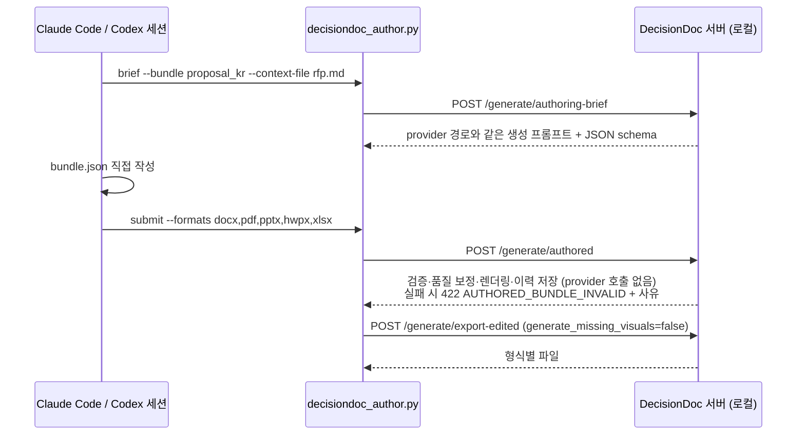
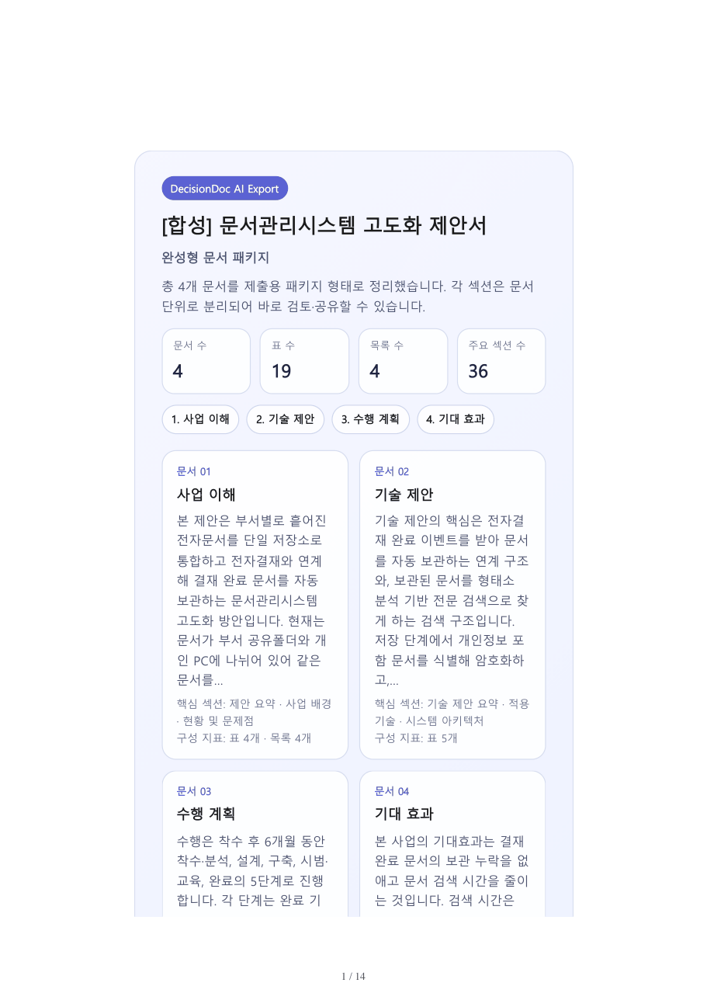
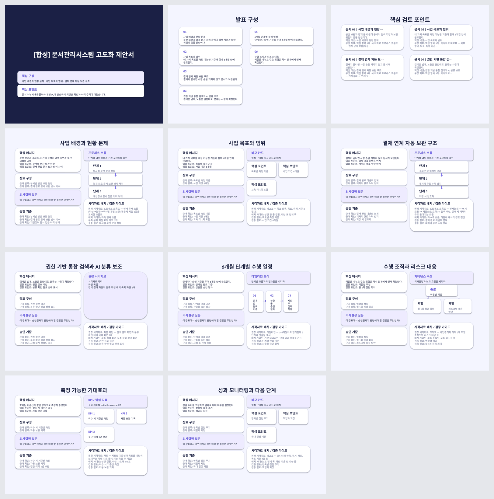
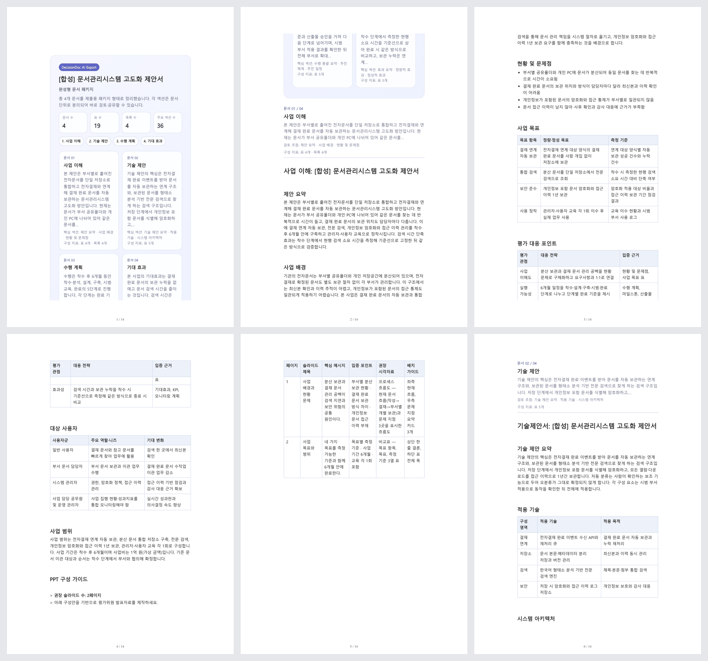
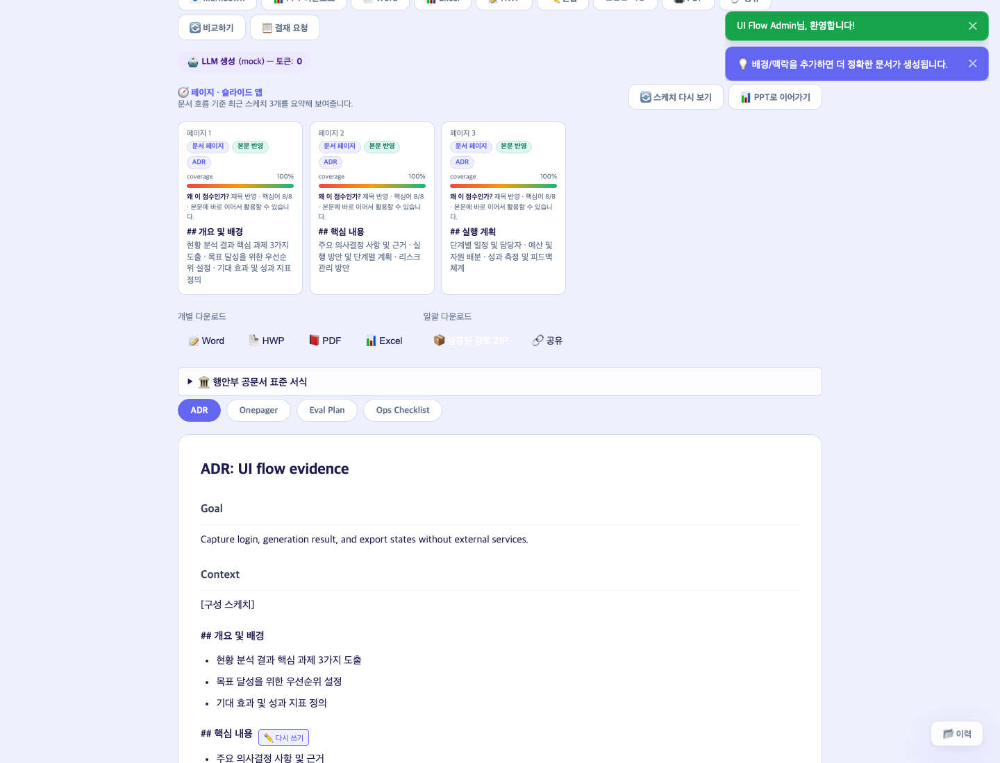

# DecisionDoc AI — 포트폴리오 요약

기준일: 2026-10-08. 이 문서의 모든 주장은 저장소의 코드·테스트·증거 파일로 확인할 수 있는 범위로 제한한다. 현재 CI 결과는 [Development Plan §0](./development-plan.md#0-current-completionreadiness-snapshot)에만 기록하고 여기서 복제하지 않는다.

## 한 줄 소개

제안서·보고서·의사결정 문서를 **구조 → 작성 → 검증 → 저장 → 5종 형식 변환**까지 한 흐름으로 다루는 로컬 문서 작업 도구. 문서 내용은 사용자의 Claude Code·Codex 세션이 쓰고, DecisionDoc은 작성 지침·스키마 검증·품질 보정·렌더링·이력·DOCX/PDF/PPTX/HWPX/XLSX 변환을 맡는다.

| 항목 | 현재 상태 |
|---|---|
| 형태 | 개인 프로젝트. FastAPI 서버 + 정적 PWA + 작성 CLI. 로컬 실행 기준 |
| 기능 | 계획한 로컬 기능 구현과 자동 회귀 검증 완료. 기능별 상태는 [Development Plan §0](./development-plan.md#0-current-completionreadiness-snapshot) |
| 아직 아닌 것 | 사람 사용 검증(UAT) 진행 전, 운영 배포 아님, 사용자 성과 수치 없음 |

## 1. 문제

컨설팅 현장에서 제안서·평가보고서는 작성자 숙련도에 따라 구조와 품질이 달라지고, 같은 목차와 표를 매번 다시 만든다. 일반 LLM 채팅은 초안은 빠르지만 다음 일을 대신하지 못한다.

- 문서 유형별 필수 구조를 지키는지 확인하기
- 근거 없는 수치·일정·금액이 섞이지 않게 하기
- 결과를 HWPX·DOCX·PPTX 같은 제출 형식으로 옮기기
- 어떤 자료로 무엇을 만들었는지 이력으로 남기기

## 2. 핵심 설계 결정

### 2-1. LLM 출력을 업무 산출물로 다룬다

문서 유형마다 `BundleSpec`이 필수 섹션·JSON schema·작성 지침을 정의한다. 생성 결과는 schema 검증, stabilizer, 품질 보정, Jinja2 렌더링, lint를 거친 뒤에만 저장되고, 저장된 Markdown이 5종 형식 변환의 단일 원본이 된다. 번들은 20종이다(`app/bundle_catalog/registry.py`).

### 2-2. 모델 호출을 서버 밖으로 옮긴다

처음에는 서버가 OpenAI·Gemini·Claude provider를 호출했다. 로컬에서 혼자 쓰는 도구로 방향을 정한 뒤, 이미 구독 중인 Claude Code·Codex 세션이 문서를 쓰고 서버는 나머지를 맡도록 경로를 하나 더 만들었다. API 키와 호출 비용이 필요 없고, 서버 파이프라인은 그대로 재사용한다.

- **같은 지침:** `authoring-brief`는 실제 생성과 같은 준비 단계(문체 예시, 프로젝트 지식, 조달 문맥)를 거친 프롬프트를 돌려준다. 테스트가 provider 경로의 프롬프트와 같은지 확인한다.
- **대체 지점 하나:** `AuthoredBundleProvider`가 provider 호출 자리만 대신하고, 캐시와 웹 검색은 쓰지 않는다. 일반 `/generate` 호출 형태는 바꾸지 않았다.
- **세션 안내:** `.claude/skills/decisiondoc-authoring/SKILL.md`가 세션의 작업 순서와 작성 규칙을 정한다.
- 설계 기록: [Agent-authored Local Generation Design](./superpowers/specs/2026-10-07-agent-authored-local-generation-design.md)

### 2-3. 근거 없는 수치를 만들지 않게 한다

- 모든 번들 프롬프트 끝에 "수치 근거" 규칙을 두고, 다른 지시가 정량 지표를 요구해도 이 규칙이 우선하게 했다(`tests/test_bundle_prompt_rules.py`).
- 짧은 맥락에서 근거 없는 수치가 들어간 필드는 품질 보정 단계가 일반 문장으로 바꾼다.
- 세션 작성 경로를 검증하다가 이 보정 문장이 특정 사업(보행 안전) 문구로 고정돼 있어 다른 주제 문서에 섞이는 결함을 찾았다. 주제 중립 문장으로 고치고 회귀 테스트를 추가했다.

### 2-4. 경계를 섞지 않는다

| 섞기 쉬운 것 | 분리한 방식 |
|---|---|
| 문서 검토 완료 ↔ 외부 제출 승인 | 검토 완료 receipt는 제출·입찰·법적 승인 권한을 갖지 않는다 |
| 원래 생성 이력 ↔ 편집본 | 편집본은 별도 사본으로 저장하고, 생성 발급 이력이 없는 편집본으로는 검토를 만들 수 없다(`409`) |
| 문체 예시 ↔ 모델 학습 | 문체 예시는 프롬프트 참고 자료일 뿐 가중치 학습이 아니다 |
| 다운로드 ↔ 재생성 | Markdown 다운로드는 브라우저에서 처리하고, 형식 변환은 `export-edited`로만 한다. 둘 다 생성 API를 다시 부르지 않는다 |

### 2-5. 상태 파일을 덮어쓰지 않는다

프로젝트·결재·이력·감사 로그 같은 상태를 tenant별 local/S3 object에 두고, 쓰기는 conditional create/CAS로 확정한다. 손상된 파일은 빈 목록으로 숨기지 않고 원본을 보존한 채 중단한다. 상세 범위는 [Contribution Note](./contribution-note.md)에 있다.

## 3. 화면과 산출물

아래 산출물은 모두 합성 데이터로 만들었고 외부 서비스를 호출하지 않았다.

**세션이 작성한 제안서의 PDF 표지** — 합성 RFP를 입력으로 Claude Code 세션이 `proposal_kr` 4개 문서를 작성했다.

**같은 문서의 PPTX 11장** — 구조화 슬라이드로 변환됐다.

**PDF 본문(첫 6쪽)**

**웹 화면의 생성 결과** — mock provider로 생성한 결과. 문서 탭, 페이지 구성, 형식별 다운로드.

## 4. 검증 방법

| 확인 대상 | 방법 | 증거 |
|---|---|---|
| 세션 작성 경로 | 저장소에 둔 작성 결과(`docs/samples/agent_authored_local/bundle.json`)를 임시 데이터 폴더의 앱에 다시 제출. 작성 문장이 결과에 모두 남는지, 5종 형식이 만들어지는지 확인 | `python3 scripts/capture_agent_authored_evidence.py` → [receipt](../evidence/cli-logs/agent_authored_evidence.json): 작성 문장 106개 모두 유지, PDF 14쪽, PPTX 11장 |
| 웹 흐름 | 로그인 → 번들 선택 → 생성 → Markdown 다운로드를 브라우저로 실행. 다운로드 중 생성 API 호출이 0건인지 기록 | `python3 scripts/capture_ui_flow_evidence.py` → [receipt](../evidence/cli-logs/ui_flow_evidence.json) |
| 회귀 | pytest(비 E2E)와 Playwright E2E를 CI에서 별도 단계로 실행 | [Development Plan §0](./development-plan.md#0-current-completionreadiness-snapshot) |
| 격리 | 검증 실행은 `.env`를 읽지 않고, 임시 데이터 폴더와 mock/local 저장소를 쓰며, loopback 외 네트워크를 막은 조건에서 했다 | 같은 문서의 각 기록 |

## 5. 기술 스택과 역할

- **Backend:** Python 3.12, FastAPI, Pydantic v2(strict), Jinja2
- **문서 변환:** python-docx, python-pptx, xlsxwriter, HWPX package writer, Playwright Chromium PDF
- **저장소:** local filesystem·S3 공통 `StateBackend`(conditional create/CAS)
- **테스트:** pytest, pytest-playwright, GitHub Actions
- **세션 연동:** Claude Code skill, Codex `AGENTS.md`, 작성 CLI

개인 프로젝트다. 개발 과정에서 Claude Code·Codex를 개발 도구로 썼고(commit의 `Co-Authored-By` 기록), 변경은 테스트와 CI 통과를 확인한 뒤 merge했다. 직접 설명 가능한 범위는 [Contribution Note](./contribution-note.md)를 기준으로 한다.

## 6. 한계와 다음 단계

| 항목 | 상태 |
|---|---|
| 사람 사용 검증(UAT) | 사전 점검까지 완료. 실제 업무 문서로 쓰는 확인은 남아 있다 |
| 실제 모델의 문서 품질 | 이 저장소의 증거는 합성 입력 1건과 mock 생성이다. 품질을 일반화하지 않는다 |
| Live provider·G2B 실데이터·운영 배포 | 비용·자격 증명이 필요해 보류했다. 실행 순서는 [completion-readiness-runbook.md](./completion-readiness-runbook.md) |
| 성과 수치 | 측정하지 않았다 |
