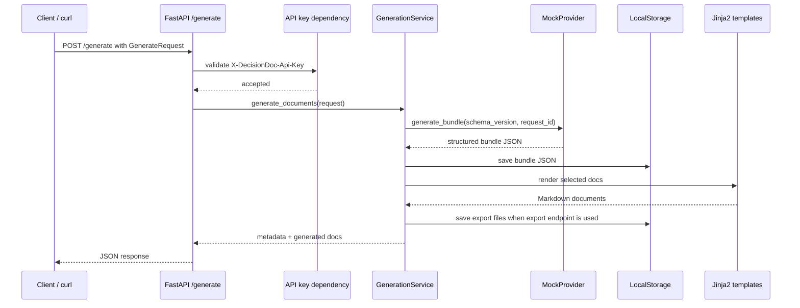

# Generation Sequence Evidence

Runtime evidence:

- `evidence/api-responses/generate-tech-decision.json`
- `evidence/api-responses/generate-export-tech-decision.json`
- `evidence/output-artifacts/export_adr.md`
- `evidence/output-artifacts/export_onepager.md`
