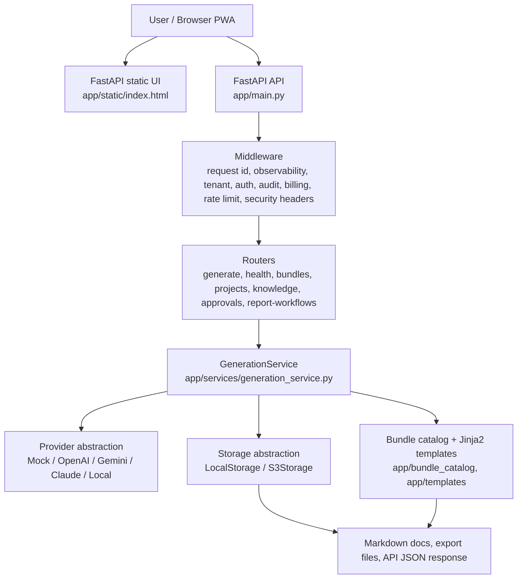

# System Architecture Evidence

Evidence files:

- `app/main.py`
- `app/routers/generate.py`
- `app/routers/health.py`
- `app/services/generation_service.py`
- `app/providers/factory.py`
- `app/storage/factory.py`
- `app/bundle_catalog/registry.py`
